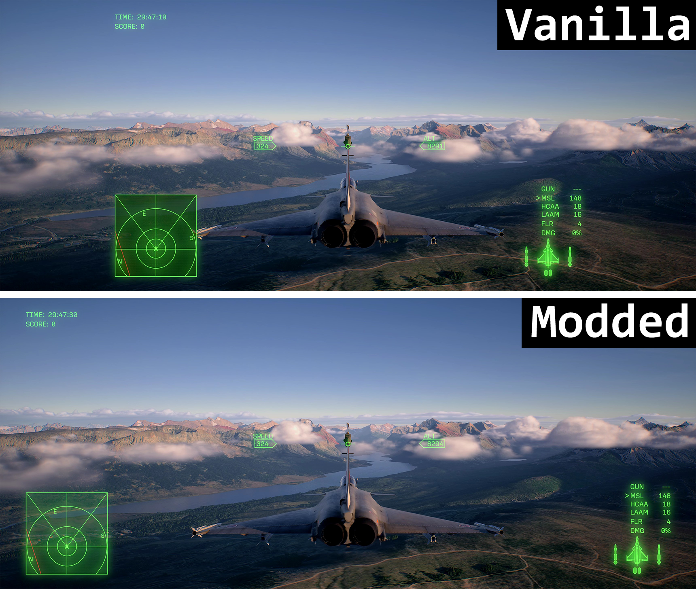
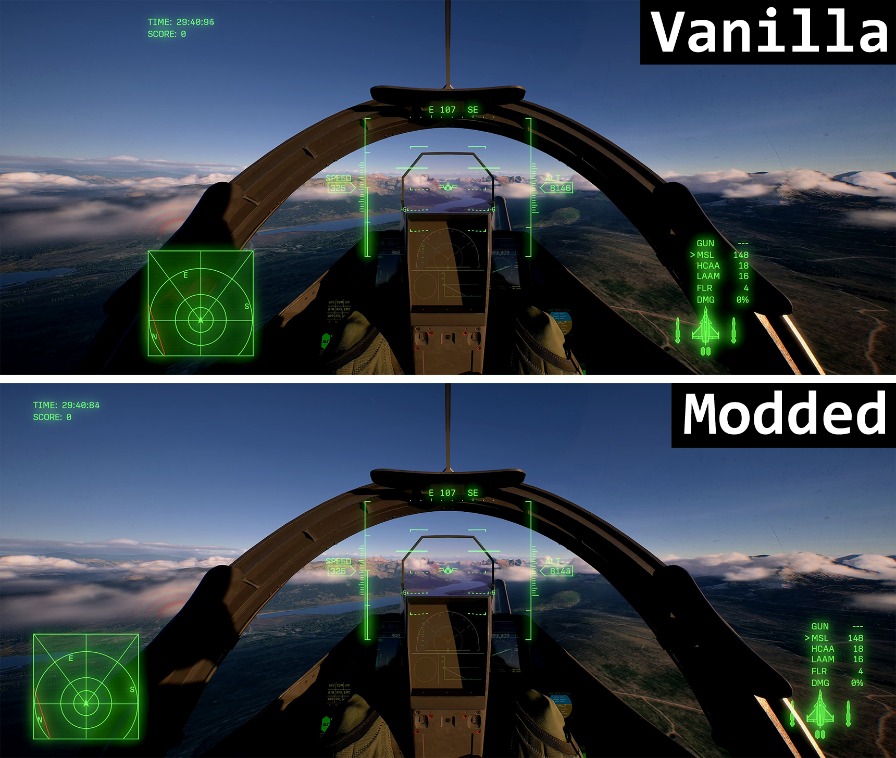
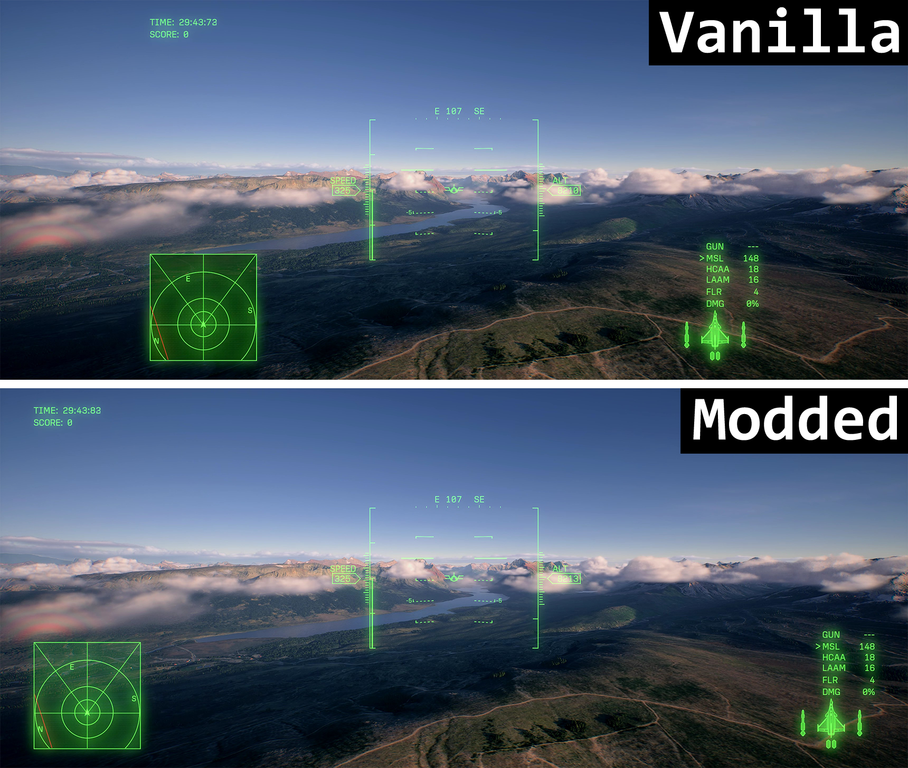

# AC8 Ultrawide HUD

Moves the gameplay HUD toward the edges of an ultrawide screen while keeping
text and icons their original size and the central HUD centred. Works with
third-person, cockpit, and HUD-only views. Menus are unchanged.

Tested on 21:9, but should work fine for 32:9 and others.

## Comparisons

Each image shows the original HUD above and the ultrawide HUD below.

### Third person



### Cockpit



### HUD only



## Installation

UE4SS must already be installed.

1. Close the game.
2. Download the mod ZIP and copy the `AC8UltrawideHUD` folder into:
   ```text
   ACE COMBAT 8/Game/Binaries/Win64/UE4SS/Mods/
   ```
3. Launch the game. The HUD adjusts automatically—no setup or hotkeys needed.

Your folders should look like this:

```text
ACE COMBAT 8/
└── Game/
    └── Binaries/
        └── Win64/
            └── UE4SS/
                └── Mods/
                    └── AC8UltrawideHUD/
                        ├── enabled.txt
                        └── Scripts/
                            └── main.lua
```

To uninstall, close the game and delete the `AC8UltrawideHUD` folder.

## Development

Python is only required to test/package the mod, not to play:

```sh
python -m pip install -r requirements-dev.txt
python tests/test_lifecycle.py
python package.py
```

The release archive is generated under `dist/`. Tests simulate UObject lifetime,
fresh Lua wrappers, viewport changes, reload ownership and bounded error logging.
They do not measure UE4SS reflection overhead or rendering frame times.
See [validation notes](VALIDATION.md) and [release notes](CHANGELOG.md).

## Development credit

GPT wrote the code and investigated the game's HUD layout. The project maintainer
directed the work and tested the results in-game.

## License

This project's own code and documentation are dedicated to the public domain
under **CC0 1.0 Universal**. You are welcome to fork, copy, modify, redistribute,
and release your own version, including for commercial use. No permission or
credit is required.

The complete CC0 text is provided in the standalone [LICENSE](LICENSE) file.
This dedication covers the project's own contributions; it does not cover
third-party software or the game's content shown in the screenshots. UE4SS and
game files are not bundled.
